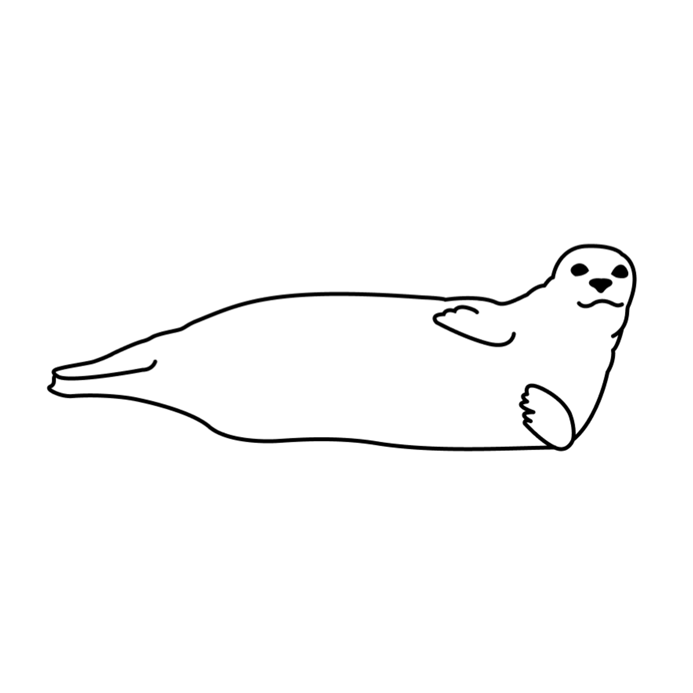

{width=100px}{width=100px}{width=100px}{width=100px}{width=100px}

### Reminders
Repo is [here](https://github.com/lizallyn/Pinniped-Case-Studies)   
Current working model is in [SocialSeals_v9.R](https://github.com/lizallyn/Pinniped-Case-Studies/blob/main/Models/SocialSeals_v9.R)  
Model Explanation Doc is [here](https://docs.google.com/document/d/1VYwdORJUO0BOJdU_s5iarZ0-YnNVYHJXVU9WCOc4RsY/edit#heading=h.wt3ajsmprmsq) (haphazardly updated right now)

### Currently Working On
Apparently I never fully implemented the social copying piece in the full loop, so I need to do that. (Added March 6, not tested yet)  
Getting the salmon bits to at least work, even if they aren't quite right...(Seems to depend on the run, need to dig into this more)  
Updating model explanation document - new parameter table is ok, but need to update with symbols and then check/update all the equations!!  
Picking my brain back up off the floor and managing to focus for more than 30 mins at a time and not cry at work :)))

### Some Fun Plots!

```{r, include=FALSE}
source("https://raw.githubusercontent.com/lizallyn/Pinniped-Case-Studies/main/Models/SocialSeals_v9.R")
```

First, here's a summary of the inputs. Right now it's parameterized for the Locks. 

#### Inputs

Species present here are Sockeye, Chinook, and Coho. Their arrival at the gauntlet each day is forced from count data at the Locks (provided by Muckleshoot).

The number of salmon of each species present at the gauntlet for each day is presented below. Really it's just salmon arriving that are an input not total numbers but I didn't keep tabs on that separately, so here's a close approximation.

```{r, echo = FALSE, fig.height=3}
salmon.arrival.data <- data.frame(cbind(1:days, gauntlet_chinook, gauntlet_sockeye, gauntlet_coho))
colnames(salmon.arrival.data) <- c("Day", "Chinook", "Sockeye", "Coho")
arrival.data <- melt(salmon.arrival.data, "Day", variable.name = "Species", value.name = "Count")
# salmon.colors <- c("dodgerblue", "salmon", "green3")
# salmon.names <- levels(escape.data$Species)
# names(salmon.colors) <- salmon.names
arrival_plot <- ggplot(data = arrival.data, aes(x = Day)) +
  geom_point(data = arrival.data, aes(y = Count, color = Species)) + 
  scale_color_manual(values = salmon.colors) +
  labs(y = "Salmon at the Gauntlet by Species")
arrival_plot
```

The only species with a fishery in this gauntlet is Coho. The fishery occurred from September 10 - November 17 in 2023. This is day 253 - 321. On those days, harvest of coho occurs via fishing effort and harvest of seals occurs via boat-based take.

Here's a quick (not exhaustive) table of parameter values:

```{r, echo = FALSE, message = FALSE, warning = FALSE}
library(knitr)
library(flextable)
library(kableExtra)
parameters <- data.frame(rbind(days, num_seals, num_seals_2_copy, sockeye_escape_rate, chinook_escape_rate, coho_escape_rate, min_fishers, max_fishers, natural_mort, harvest_max_perboat))
colnames(parameters) <- c("Value")
kable(parameters) %>% kable_styling(full_width = F)


```

#### Ok, Now the Plots

##### Probability of going to the gauntlet based on foraging experience (P_x), experiences with hunting (P_y), and overall (Prob_G).
Right now these seem to be responding appropriately to the presence of salmon in the system and the presence of hunt effort. We still have decisions to make about how P_x and P_y combine, but this at least works.

```{r, echo = FALSE, fig.width = 10}
plot_Px + plot_Py + plot_probs + plot_layout(guides = "collect")
```

##### Salmon consumption and foraging learning
Seal 10 is prominent because right now all the seals eat the same number of salmon on each day, if they are selected to eat any.
```{r, echo = FALSE}

went_plot <- data.frame(cbind(1:days, colSums(seal_forage_loc)))
colnames(went_plot) <- c("Day", "went")
plot_went <- ggplot(data = went_plot, aes(x = Day, y = went)) +
  geom_point(color = "turquoise") +
  labs(y = "Seals at the Gauntlet")

plot_went/plot_eaten

(plot_C/plot_x/plot_Px/plot_probs) + plot_layout(guides = "collect")
```


### Currently Need Help With

#### *Issue 1: Terminology - what are all the components?*

Apparently I need to go back to 454 because I'm having a really hard time putting together a coherent parameter table. What are the different types of objects I'm creating? Which things are states/variables/rates/parameters/etc.? 

#### *Issue 2: Low Confidence that I'm doing the salmon part well*


#### *Issue 3: tabled bc it stopped happening???*

Last meeting we talked about how the instantaneous salmon rates would need to be calculated at a shorter time step in order to produce reasonable estimates when the ratio of seals to salmon is high or the total number of salmon is low. Instead of doing that, we talked about just manually calculating the salmon mortality terms on days when the results from the instantaneous process don't make sense.  
So my work-flow right now is:  

* check to see if any of the rates estimated by the rungeKutta function are negative
  + if no, use them to update the relevant variables
  + if yes, assume that no mortality or escape happens in that time step for that species
    + (I was under no impression that this would be a permanent solution)

What's annoying is that right now I'm having an issue where the Chinook are returning utterly nonsense consumption estimates, and they aren't caught by this process because none of the estimated mortality/escape rates are negative. 
The below plot shows salmon (of all species) consumed per seal that went to the gauntlet in each time step. Obviously 100+ salmon per seal doesn't make a lot of sense.
(I know there's weird stuff going on at day 250 too, but that's a separate Sockeye problem.)

```{r, include=FALSE}
source("https://raw.githubusercontent.com/lizallyn/Pinniped-Case-Studies/main/Models/SocialSeals_v9.R")

consumed_plot <- melt(data = salmon_consumed, "Seal")
colnames(consumed_plot) <- c("Seal", "Day", "Consumed")
plot_consumed <- ggplot(data = consumed_plot, aes(x = Day, y = Consumed)) +
  geom_point(color = "turquoise")
```

```{r, echo = FALSE, fig.width = 5, fig.height=3}
plot_consumed
```

I did some sleuthing, and around day 182 & 194, the estimate for the number of Chinook consumed skyrockets (1000+), even though the number of Chinook in the system is only 5-6. I plotted the Chinook consumption estimate over a range of values for the starting number of Chinook, and there's clearly something weird that happens between 4 and 6.

```{r, include = FALSE}
rungeKutta.ts <- function(Cmax, Nseal, alpha, Ns, gamma, Y, F_catch, M, E, deltat = 1){
  X <- c(Ns, 0, 0, 0)
  K1s <- get_dXdt(Cmax, Nseal, alpha, Ns = X[1], gamma, Y, F_catch, M, E)
  midX <- X + deltat* 0.5 * K1s
  K2s <- get_dXdt(Cmax, Nseal, alpha, Ns= midX[1], gamma, Y, F_catch, M, E)
  midX <- X + deltat * 0.5 * K2s
  K3s <- get_dXdt(Cmax, Nseal, alpha, Ns= midX[1], gamma, Y, F_catch, M, E)
  endX <- X + deltat * K3s
  K4s <- get_dXdt(Cmax, Nseal, alpha, Ns= endX[1], gamma, Y, F_catch, M, E)
  Xsim <- X + deltat * (K1s / 6 + K2s / 3 + K3s / 3 + K4s / 6)
  return(c(C = Xsim[2]))
}
```

```{r, echo = FALSE, fig.width = 7, fig.height = 3}
plot(x = seq(1, 7, 0.1), 
     y = lapply(seq(1, 7, 0.1), rungeKutta.ts, Cmax = 5, Nseal = 8, alpha = 1, 
                gamma = 0, Y = 0, F_catch = 0, M = 0.0005, E = 0.03, deltat = 1), 
     ylab = "Estimate of salmon consumed", xlab = "Ns input", 
     main = "Cmax = 5, Nseal = 8, alpha = 1, gamma = 0, Y = 0, F_catch = 0, 
     M = 0.0005, E = 0.03, deltat = 1")
```

What am I looking at here? I don't really understand where this could be coming from?

In trying to solve this problem I'm losing confidence in my whole approach to solving this problem. What is the threshold for results that I should consider unusual or worth overwriting? What assumption do I make about the various mortality/escape rates when I calculate them manually? There is probably a better way to do this whole section, but I'm not sure how to start thinking about that?

### Victories
Created this page! Thanks to Emily for the idea!

